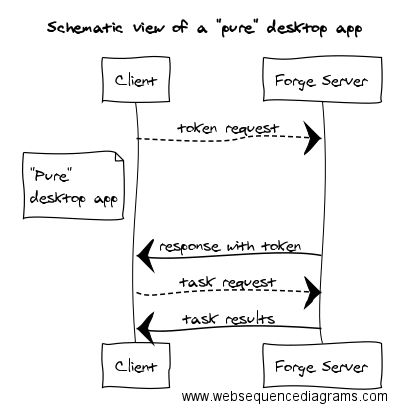
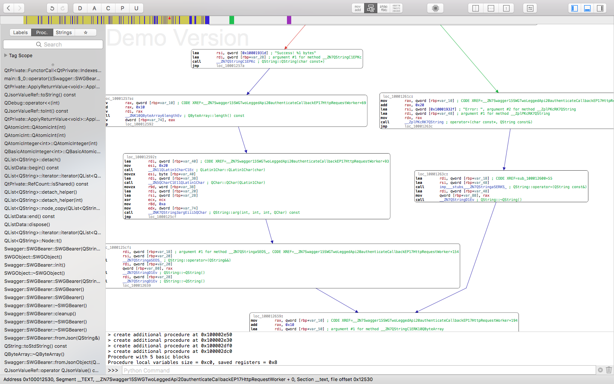

## Forge API in desktop apps: challenges and solutions

This article discusses the special challenges faced when making use of a pure cloud-based system such as Forge from a pure desktop application.

***"Don’t check passwords into source control or hard-code them in your application.
Operations staff will remove your eyes with a spoon if they catch you doing this.
Don’t give them the pleasure."***

This nice quote is from Jez Humble and David Farley's book *[Continuous Delivery](http://martinfowler.com/books/continuousDelivery.html)*, and continues: 

***"Passwords should always be entered by the user performing the deployment. There are several acceptable ways to handle authentication for a multilayer system. You could use certificates, a directory service, or a single sign-on system."***

All this is nice and clear in case of a web app, or Software-as-a-Service, as I prefer to call it, where usually the client is a browser (or a thin desktop client) and you control the server that connects to Forge services, similar to the situation shown in this schematic view:

You are in control of the web app server, where you can use best practices to secure the Forge related secrets (at least Client ID and Client Secret, and better still for tokens too).

In our samples, we (almost) always recommend setting your secrets using environment variables, instead of hard coding them.

------

------

However, what about a desktop only application? What if I want to develop a desktop application that directly connects to Forge servers?
I just want to compile my app and distribute the binary to my customers, and I don't want to waste my time with maintaining a server.

### Main Questions

- How can the Forge related secrets be secured in case of a desktop app?
- What are the best practices?
- What other challenges await us?

These are the topics we explore in our endeavor to develop a "pure" desktop app, schematically represented like this:

No other services involved, no proxy, just calling the Forge endpoints directly.

So... we have at least a pair of secrets (Client ID and Client Secret) on our hand; how can we secure them in a desktop environment?

Setting them in environment variables, as suggested for web apps, is obviously a catastrophic idea from a security perspective; it is completely transparent, and the people with spoons will come for you sooner than you expected.

### Hard-Coding Secrets in a Desktop App

What about hard-coding the credentials in the source code using a compiled language, compiling that, and distributing just the binary? 

At first sight this might seem like a useful approach, using a very light version of [security by obscurity](https://en.wikipedia.org/wiki/Security_through_obscurity).

Let us examine this approach closer by creating a very simple "Forge Hello World" program.

What language can be better suited for illustration purposes than C++?

A self-explanatory example, where we see the secrets in the code, but we are not going to distribute that to our customers; instead, we compile it and distribute just the binary.

So our secrets are safe, right?

Well... not really...

Take any Unix-like OS, run the [strings](https://en.wikipedia.org/wiki/Strings_(Unix)) command on your binary, and you will be surprised how many things come up, along with our secrets:

 
An expected reaction to this is, "C'mon, who keeps secrets in plain text, you should scramble them, encrypt them, or even better, put them into a database and fetch them when needed."

Yes, true, that will increase the difficulty of retrieving your secrets, but will not make it impossible, and it might not be so difficult after all.

To illustrate this, we can use any disassembler and have a look at our code:

Here we again see our beloved secrets and, yes, our secrets are still in plain text, just reinforcing the above idea in a more visually appealing context. 

Now let us ask ourselves, if I can see the variables, can I see the functions/procedures? 

The answer is obviously "yes", and any self-respecting disassembler will give you the ability to see not only the call stack, but also the call paths:

"Why should we care?" &ndash; you may ask. Well ... it doesn't matter how well you [obfuscated](https://en.wikipedia.org/wiki/Obfuscation_(software)) your code, the machine must understand it and functions calls must be made &ndash; meaning that you can trace those calls and identify the procedure responsible for assembling the request to Forge endpoints. Thus, sooner or later, you must decrypt your secrets, or fetch them from a database, and assemble them into a request to Forge endpoints, which means that at a given moment your secrets will be exposed in the call stack, and all a hacker needs to do is just to "camp" in that very procedure and wait for your secrets to pop up.

We should make one thing very clear: if your desktop app is on somebody's machine, he can do anything he likes with it: crack it, break it and even cheat it.

For instance, to get a [2-legged token](https://developer.autodesk.com/en/docs/oauth/v2/tutorials/get-2-legged-token/), you have to send a `POST` request (along with your secrets) to `https://developer.api.autodesk.com/authentication/v1/authenticate`. Who says it is not possible to fool the app and redirect it to your own TLS-enabled server, where you can transparently see the given secrets?

Also, your application must rely on some libraries assuring a secure network connection, like [OpenSSL](https://www.openssl.org). If your application is dynamically linking to that library, then a user can easily compile his own version of that library, with security reduced to zero, pass in his version of the library to your application, easily listen to all the traffic, and extract the needed secrets from that.

In conclusion, to quote one of my favorite movies, [the only winning move is not to play](http://www.imdb.com/title/tt0086567/?ref_=ttqt_qt_tt). In this case, the only winning move is to neither hard-code, nor even pass through your app the secrets.

Or, as Benjamin Franklin says, "Three may keep a secret, if two of them are dead".

### Security In Updates?

Meantime, looking at another security aspect, ask yourself this question: *"If I embed/hard-code them, how I am supposed to update them in case my secrets are compromised?"*. 

In this case, you will have to change and recompile your app and of course change them for each client individually. You cannot update them remotely &ndash; you said that you don't want to keep a server for that application. At his point, the happiness of having thousands of clients using your application may rapidly turn to sorrow.

In summary, hard-coding secrets into your desktop app is a bad idea not only because of "guys with spoons", but also because of problems related to changing of Forge secrets (due to compromised secret, migration to another Forge app etc.). Updating credentials is absolutely a non-trivial challenge.

### Callback URL for 3-Legged OAuth

Enough with security; is there anything else?

Unfortunately, there is. 

Sooner or later your app will need a 3-legged token, and here is another fun problem...

You must get the end user's consent to access Forge resources. Since Forge OAuth does **not** support the [password grant type](https://support.zendesk.com/hc/en-us/articles/203663836-Using-OAuth-authentication-with-your-application) for exchanging the username and password for an access token directly, you have to redirect the end user to an Autodesk server, either by opening the system browser or embedding the sign-in page in a WebView ([strongly discouraged](https://developers.google.com/identity/protocols/OAuth2InstalledApp)).

You must extract the authorization code from the `redirect_uri`, and to do that you must listen for it, which means that will need a local server &ndash; so you will need a server after all (yeah, but it is a local one).

But wait, there is more: this server must open the port specified in the **CallBack URL**.

-------

-------

This means that in case of installation on a client's machine, you must have the rights to open this port and **this port must be available**. I assume that you could do a survey among your clients, find out what ports they have available, and tailor your CallBack URL to the commonly available port, but... I hope you understand that I am just kidding.

Funny, yet quite challenging a problem to solve.

#### Call Number Limitation

Is there more?

Yes, there is.

As a last topic in this article, yet I fear not the last to be dealt with.

In many cases, as a defensive measure again different kinds of abuse, limits or other restrictions are imposed on some calls. For example, in case of the request to retrieve the up-to-date list of Forge-supported translations:

When the user of your desktop application starts up the app, it might be good idea to make sure that the he gets the latest available list of supported translations, so your app will call this endpoint. As a defensive measure, this API call mentions "30 calls per minute" as a rate limit. By the [pigeonhole principle](https://en.wikipedia.org/wiki/Pigeonhole_principle) (yes, I am showing off with my math knowledge), this means that the 31st call may be problematic, posing a nice challenge for you to deal with: "World-wide, no more than 30 apps should start within a 1 minute time frame". Please don't answer "[impossible... but doable](http://www.imdb.com/title/tt0137494/?ref_=ttqt_qt_tt)" &ndash; this is usually my answer.

### Conclusion

To summarise, here are the identified challenges that we should deal with when developing pure desktop applications using REST APIs in general and Forge APIs in particular:

- Forge secrets security
- Forge secrets update, including access revocation
- Resource (ports) availability
- Service restrictions/limits

Many others have not been discussed, e.g., accountability.

In the end, I want to note that I am not saying that it is impossible to create Forge powered "pure" desktop applications.

However, the effort of dealing just with the questions listed above is substantial compared to simply implementing a server in the cloud.

Moreover, having a cloud server gives you more control and opportunities. Here, I am not only referring to scalability, availability and other \*abilities, but more to things like having your server act as a proxy and serving requests through it, thus giving you more fine-grained control over things like token monitoring and revocation, access monitoring and control, task prioritization etc.

